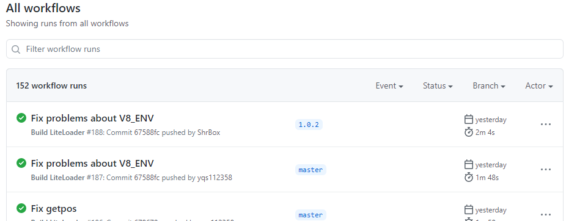
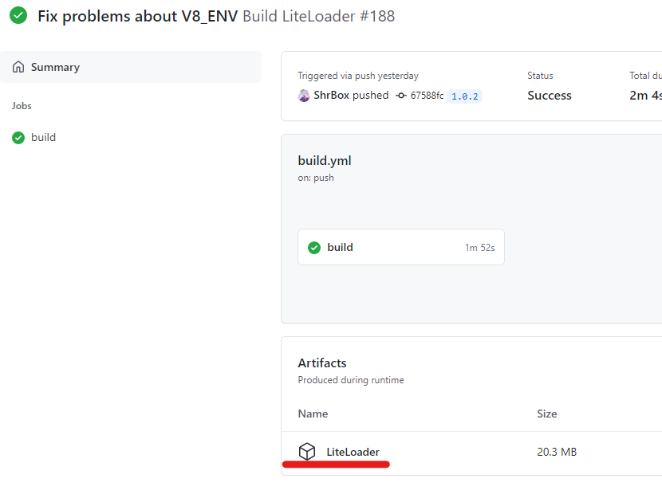
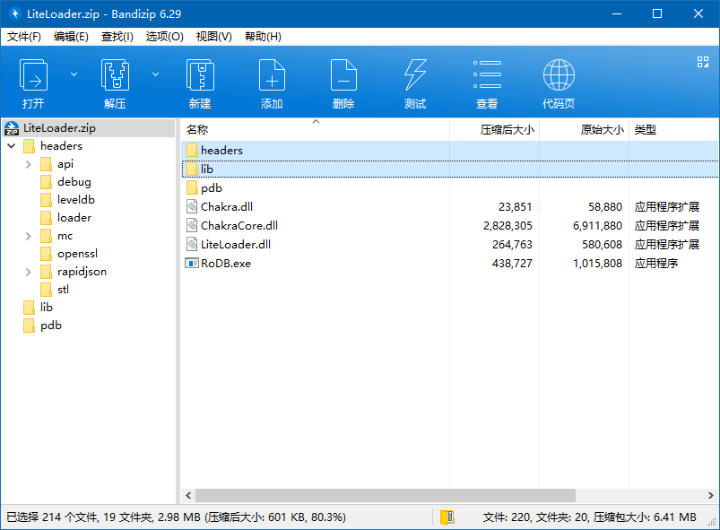
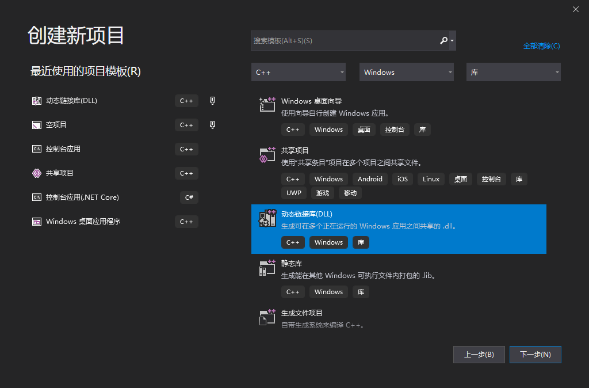
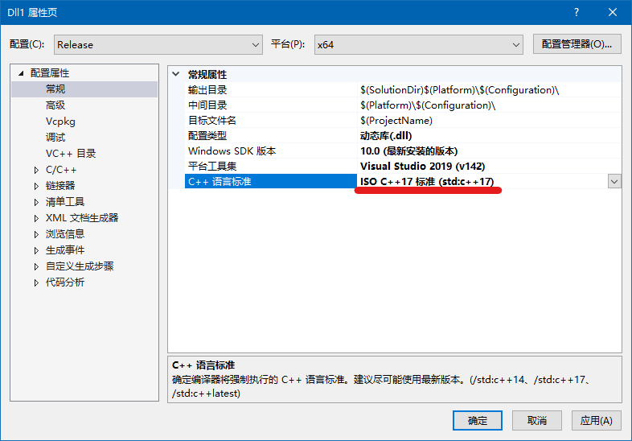
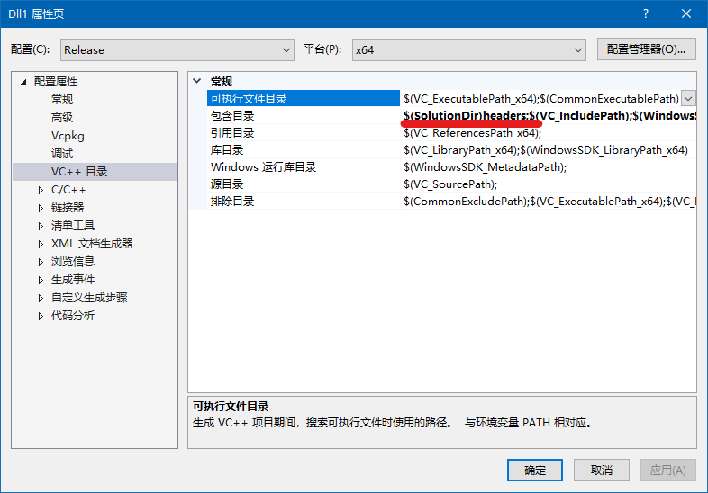

# Initialize project
## 1.Install Visual Studio
Download Visual Studio Community 2019 from https://visualstudio.microsoft.com/  

## 2.Download latest build from Github Actions
Open https://github.com/LiteLDev/LiteLoaderBDS/actions  
Download the latest build:


You need to login github account before download the file  
After download is complete, open the zip file, unzip `headers` and `lib` folder


## 3.Create project
Open Visual Studio, then create dynamic link library project

Then copy `headers` and `lib` folder to project directory  
Right click the project, then click **Property**  
  
Change **C++ language standard** to **C++17**

Switch to **VC++ directory**, add `$(SolutionDir)headers;` in **Including directory** as the picture shows

After doing this, remember to adjust the project to **Release x64**


Open `pch.h`, delete`include "framework.h"` and add `#include <iostream>` to the file  
Open `dllmain.cpp`, add the following at the beginning and end of the file:
```cpp
#include "framework.h"
```
```cpp
void entry();

extern "C" {
    _declspec(dllexport) void onPostInit() {
        std::ios::sync_with_stdio(false);
        entry();
    }
}
```
Create a cpp file for function `entry`, you can also declare the function in `dllmain.cpp` directly  
Add the following content in the newly created file:
```cpp
void entry() {
    std::cout << "Hello World\n";
}
```
Compile the project, you can find dll file in`Project\x64\Release\`, copy it to LiteLoader's **plugins** folder, run the bedrock server, you can see the console outputting **Hello world**