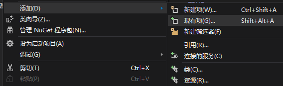

# 基础事件
LiteLoader内置的一套基础事件系统，为开发者省去了寻找符号的麻烦  
要引用LiteLoader内置的Api，你需要将**LiteLoader.lib**添加进项目  
右键项目名称，选择**添加->现有项**，然后找到项目所在目录下的**lib**文件夹中的**LiteLoader.lib**，点击添加  
  


首先在`pch.h`中添加如下代码以引用事件系统和`Player`(玩家)类的头文件：  
```cpp
#include <api/Basic_Event.h>
#include <mc/Player.h>
```
然后在项目的`entry`函数中添加以下示例代码：  
```cpp
Event::addEventListener([](PlayerDestroyEV ev) {
        string name = ev.Player->getNameTag();
        string pos = std::to_string(ev.blkpos.x) + "," +  std::to_string(ev.blkpos.y) + "," +  std::to_string(ev.blkpos.z);
        std::cout << name << "在" << pos << "破坏了一个方块\n";
        });
```
这样，插件就监听了玩家破坏方块事件并在事件触发时在控制台输出信息  
你也可以选择不用lambda表达式：  
```cpp
void entry() {
    Event::addEventListener(playerDestroy);
}

void playerDestory(PlayerDestroyEV ev) {
    string name = ev.Player->getNameTag();
        string pos = std::to_string(ev.blkpos.x) + "," +  std::to_string(ev.blkpos.y) + "," +  std::to_string(ev.blkpos.z);
        std::cout << name << "在" << pos << "破坏了一个方块\n";
}
```
目前可使用事件系统监听的事件有  
```cpp
namespace Event {
LIAPI inline void addEventListener(function<void(JoinEV)> callback);//玩家加入服务器
LIAPI inline void addEventListener(function<void(LeftEV)> callback);//玩家离开服务器
LIAPI inline void addEventListener(function<bool(ChatEV)> callback);//玩家聊天
LIAPI inline void addEventListener(function<void(ChangeDimEV)> callback);//玩家改变维度
LIAPI inline void addEventListener(function<void(ServerStartedEV)> callback);//服务器启动
LIAPI inline void addEventListener(function<bool(PlayerUseCmdEV)> callback);//玩家使用命令
LIAPI inline void addEventListener(function<bool(CmdBlockExeEV)> callback);//命令方块执行
LIAPI inline void addEventListener(function<void(RegCmdEV)> callback);//注册命令
LIAPI inline void addEventListener(function<void(PlayerDeathEV)> callback);//玩家死亡
LIAPI inline void addEventListener(function<void(PlayerDestroyEV)> callback);//玩家破坏方块
LIAPI inline void addEventListener(function<void(PlayerUseItemOnEV)> callback);//玩家使用物品在一个方块上
LIAPI inline void addEventListener(function<void(MobHurtedEV)> callback);//生物被攻击
LIAPI inline void addEventListener(function<void(PlayerUseItemEV)> callback);//玩家使用物品
LIAPI inline void addEventListener(function<void(PostInitEV)> callback);//LiteLoader加载时
LIAPI inline void addEventListener(function<void(MobDieEV)> callback);//生物死亡
LIAPI inline void addEventListener(function<void(PreJoinEV)> callback);//玩家连接服务器
};  // namespace Event
```