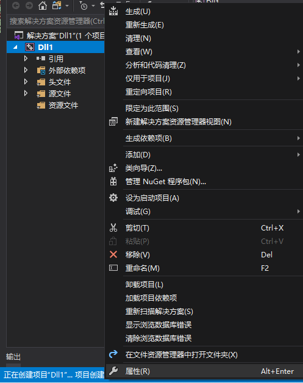

# 初始化项目
## 1.安装Visual Studio
访问 https://visualstudio.microsoft.com/ 下载Visual Studio Commnuity 2019
下载完成后打开安装器，您将看到如下界面  

请勾选`使用C++的桌面开发`，然后冲一杯咖啡等待安装过程的完成，如果您的硬盘空间不足可以取消勾选一些自己用不到的选项

## 2.从Github Actions下载最新的构建
打开 https://github.com/LiteLDev/LiteLoaderBDS/actions  
下载最新的构建，如下图所示  
  
  
如果无法下载，请先登录Github账户  
下载完成后，打开zip文件，将压缩zip中的`headers`和`lib`文件夹解压  


## 3.创建项目
打开Visual Stdio，创建一个动态链接库项目  
  
项目创建完成后，将之前解压得到的`headers`和`lib`文件夹复制到项目所在文件夹内  
然后右键新建的项目的名称，点击**属性**  
  
将图中的**C++语言标准**改为**C++17**  
  
切换到**VC++目录**选项卡，在**包含目录**中添加`$(SolutionDir)headers;`，如图所示，完成后点击确定  
  
回到项目后记得将解决方案配置调整为**Release**，将解决方案平台改为**X64**  


打开`pch.h`，删除`include "framework.h"`并添加`#include <iostream>`  
打开`dllmain.cpp`，在文件开头和末尾分别添加以下内容：  
```cpp
#include "framework.h"
```
```cpp
void entry();

extern "C" {
    _declspec(dllexport) void onPostInit() {
        std::ios::sync_with_stdio(false);
        entry();
    }
}
```
然后创建一个cpp文件用于存放插件入口函数`entry`，也可以直接在`dllmain.cpp`定义`entry`  
在新建的文件内添加以下内容：  
```cpp
void entry() {
    std::cout << "Hello World\n";
}
```
然后编译项目，你可以在`项目所在目录\x64\Release\`文件夹中找到编译好的dll，将它复制到LiteLoader的`plugins\`文件夹中，若服务器启动时输出了Hello World则插件已加载